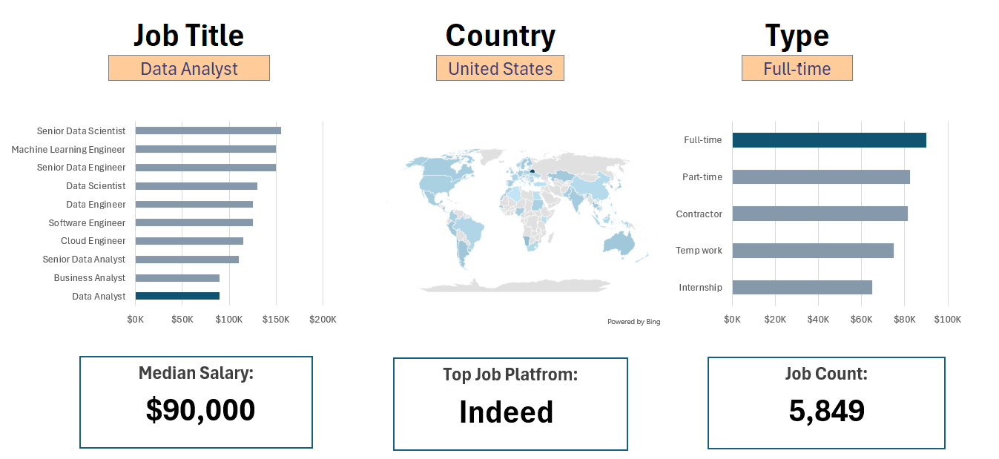

# Excel Salary Dashboard

## 📊 Data Job Analysis Dashboard

## 📊 Dashboard Preview
Here’s the Excel Salary Dashboard:

## Introduction
This project analyzes job salary data using Excel to provide insights into different roles, industries, and locations.  
The goal is to help job seekers and analysts understand trends in pay and job availability.  

The dataset used in this project comes from [Indeed](https://www.indeed.com/) and includes job postings with salary details. 
It includes data cleaning, exploratory analysis, and visualization.

## 📁 Dataset
The dataset contains job postings with the following fields:
- Job Title  
- Company  
- Salary  
- Type (Full-time/Part-time)  
- Location  
- Skills  

## 📊 Key Insights
- Top in-demand job roles
- Salary distribution
- Remote vs on-site opportunities

## 🗂 Excel Skills Used
- Pivot Tables  
- Charts  
- Data Validation  
- Conditional Formatting  
- Formulas & Functions
- Charts & Dashboards

## 🚀 Tools Used
- Microsoft Excel

Conclusion

This project demonstrates how Excel can be used for data cleaning, analysis, and visualization.
By combining pivot tables, charts, and data validation, the dashboard provides insights into:

Which job titles have the highest salaries

Which roles are most in-demand

How job opportunities vary across locations and job types
